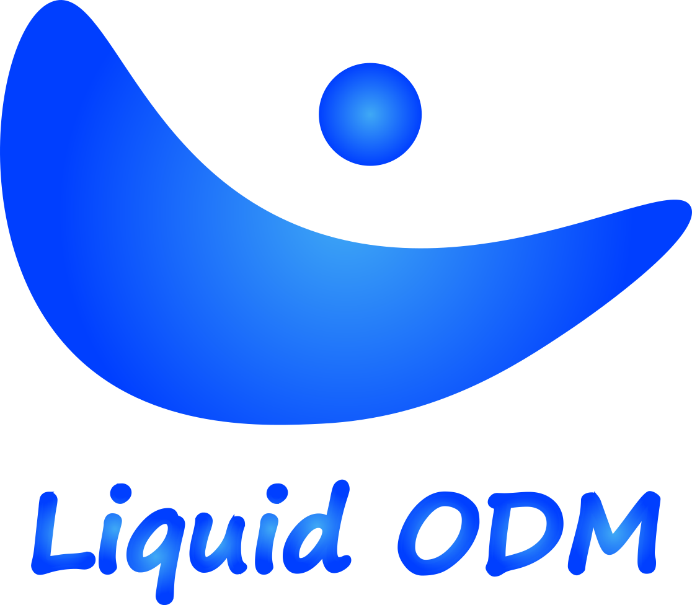

<!-- markdownlint-disable-next-line -->

  

# Liquid ODM

**Liquid ODM** is a generic Typescript ODM(Object Document Mapper) for NoSQL databases mainly designed to be used with firebase and similar databases.

## Installation [COMMING SOON]

Liquid ODM will be available as an npm and github registry package.